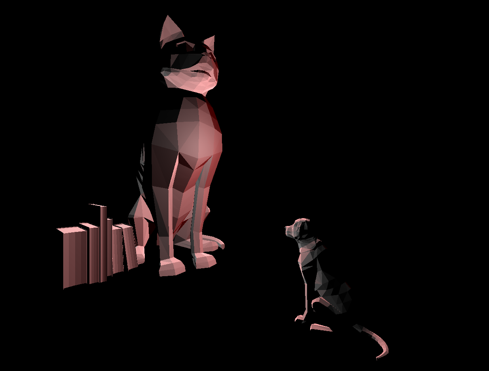

# CMPM163Labs
LAB 4: TopLeft- Cube using texture A and normal map with built in texture functionality. 
TopMiddle- Cube using just texture A with built in texture functionality, from given code.
TopRight- Cub using texture B and normal map with built in texture functionality.
BottomLeft - Cube with texture C loaded with shaders, given code.
Bottom Right - Cube with texture D tiled with shaders. I added a check to see if the coordinate values were over the middle and subtracted by that amount. I then doubled the uv coordinates to make it a 2x2 tiled texture.
24-A: x = 7U, 24-B: y = 7-7V, 24-C: Light grey
VIDEO:https://drive.google.com/file/d/1RvuSz9o2xQiWncCKeKBGSXwGVEGxRmmm/view?usp=sharing

LAB 3:
  VIDEO: https://drive.google.com/file/d/1QmAbsd8bA_K8N0Il5IcTnq81k8V-5Alo/view?usp=sharing
 TOP CUBE- my shader that sets the cube to a rainbow. Removed the mix and uniforms and not setting a specific color.
  LEFT CUBE-my material with a wireframe, colored pink and is pink emissive as well
  CENTER CUBE- The given cube material, grey with green specular
  RIGHT CUBE- given shader, interpolates between blue/green

video: https://drive.google.com/file/d/1QVgNTmX-pl46-ZUmYZsG0yxcRLbK-mSH/view?usp=sharing

